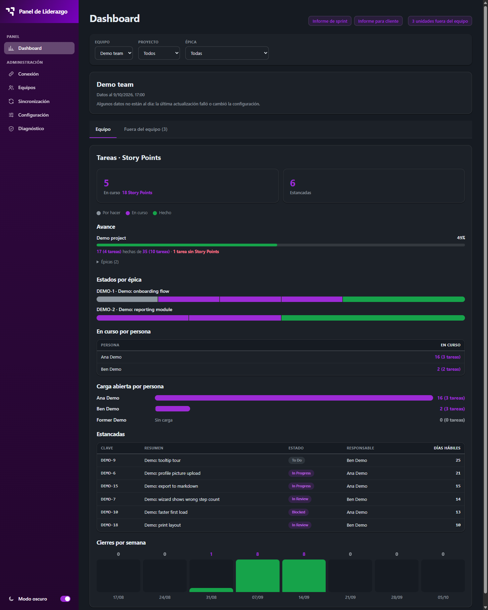
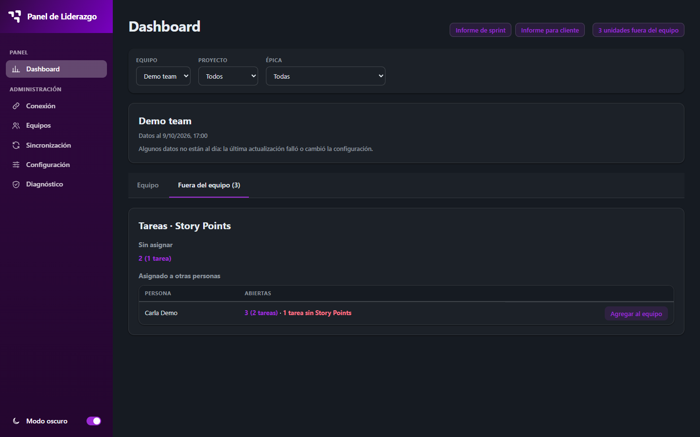
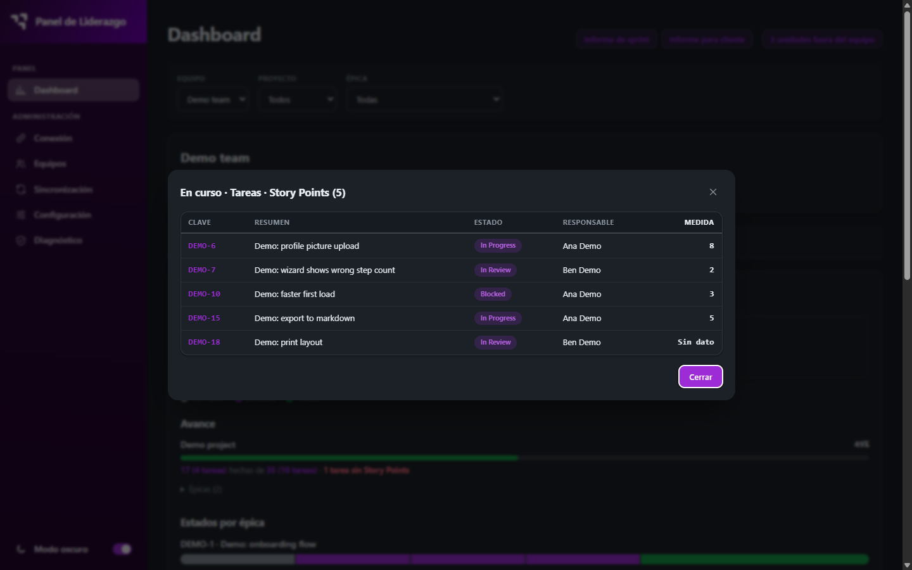
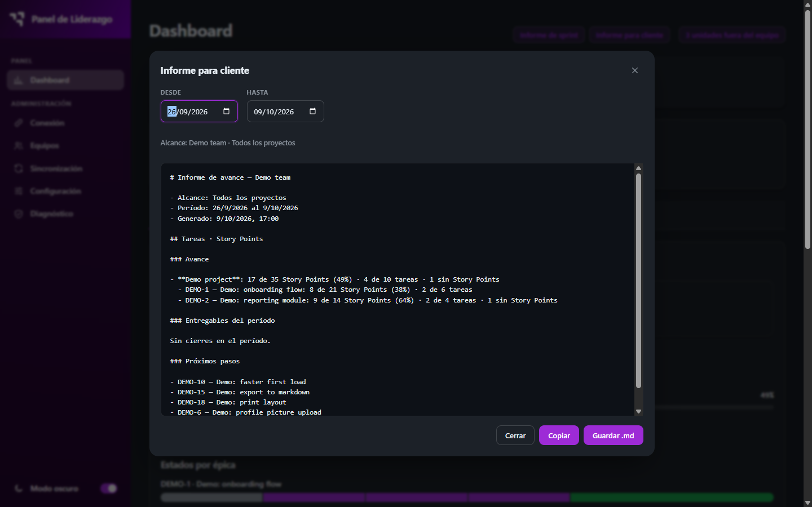
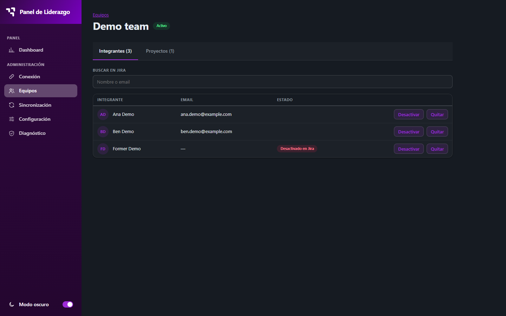
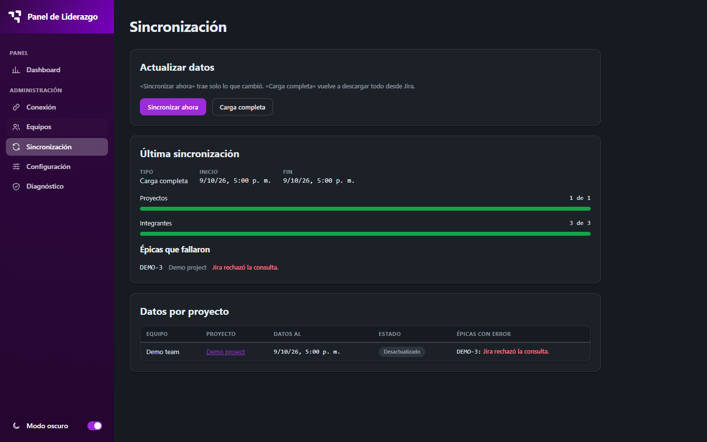
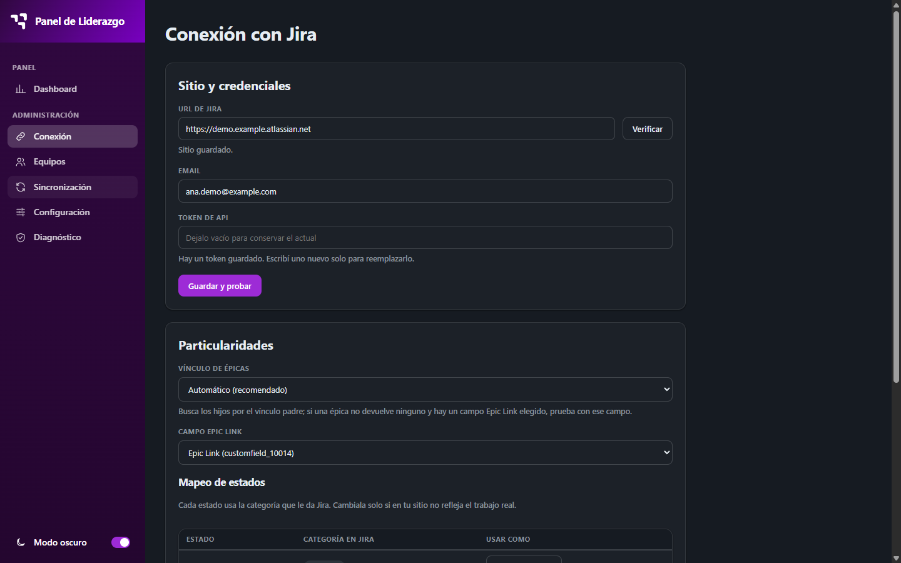

# Leadership Panel

> Flockit AI Day challenge — **"Panel único de liderazgo"** (single leadership panel).
> Unify in one tool what today are several loose projects — sprint reports, client reports,
> team metrics, and MCP queries to Jira/Flocktools — connected to the real APIs of each system.

A Windows desktop app that shows a technical lead the work of their teams, read directly from a
single **Jira Cloud** instance. One dashboard, one source of truth, and reports generated from the
same numbers. The app is **read-only on Jira**: it never writes to it.



*Screenshots use the built-in demo data (fictional people, `DEMO-*` keys).*

## Contents

[What it does](#what-it-does) · [Getting started](#getting-started) · [Atlassian API token](#atlassian-api-token) ·
[Usage](#usage) · [Architecture](#architecture) · [Database security and recovery](#database-security-and-recovery) ·
[Decisions](#decisions) · [Limitations](#limitations) · [Evolution](#evolution) ·
[Repository layout](#repository-layout) · [Testing](#testing)

---

## What it does

| Area | What you get |
|---|---|
| Connection wizard | Verify the Jira site, test credentials, set Jira particularities. |
| Teams and members | Members are searched in Jira and stored by `accountId`, never typed by hand. |
| Projects and measurement | A project belongs to one team. Unit: tasks (default), subtasks, or both side by side. Measure: count (default) or a numeric Jira field (story points, original estimate). |
| Epics | An epic belongs to one project; scope is per epic. |
| Sync | "Sincronizar ahora" fetches only what changed (delta); "Carga completa" re-downloads everything. Progress is shown while it runs. |
| Dashboard (M1–M6) | Progress, status distribution, work in progress, load per person, stale work, weekly throughput. Every number opens the list of items behind it (drill-down). |
| "Fuera del equipo" (F1–F2) | Work in the team's epics that is unassigned (F1) or assigned to people outside the team (F2), kept apart from the main metrics. "Agregar al equipo" adds someone from there. |
| Reports | Sprint report (internal) and client report (no people names, enforced by a test). Preview, **copy**, or **save as `.md`**. |
| Theme | Light and dark. |
| Diagnostics | Local service health, connection test, test-epic check, and the database recovery action. |

No rankings or comparisons between people. When data is missing (no measure values, no history),
the card says so instead of showing a misleading `0`.

| | |
|---|---|
|  |  |
|  |  |
|  |  |

Light theme: [`dashboard-light.png`](docs/screenshots/dashboard-light.png). The UI copy is in
Spanish (es-AR); code identifiers and docs are in English.

## Getting started

### Requirements

- **Windows** (the token and the database key are protected with Windows `safeStorage`).
- **Node.js 24** — developed and tested on 24.18.0 (not enforced: there is no `engines` field or
  `.nvmrc`).
- A Chrome/Chromium install only for the Angular unit tests (`npm test`).

### Install

```bash
npm ci          # or: npm install
```

Install scripts need approval in some setups, so the Electron binary may not be downloaded. If
`electron` is missing, run once: `node node_modules/electron/install.js`.

### Run

| Goal | Command |
|---|---|
| Desktop app (builds the UI, then opens Electron) | `npm run desktop` |
| Desktop app, development (`ng serve` + Electron with `--dev`) | `npm run desktop:dev` |
| Desktop app with demo data | `npm run desktop:demo` |
| Development with demo data | `npm run desktop:dev:demo` |
| Angular dev server only (no desktop shell) | `npm start` |
| Production build for Electron | `npm run build:desktop` |

For development you can put `JIRA_BASE_URL`, `JIRA_EMAIL` and `JIRA_API_TOKEN` in `.env` or
`.env.local` (see `.env.example`; real environment variables win; packaged builds ignore these
files). Never commit real values.

### Demo mode

`--demo` runs the whole app on **fictional data** — no Jira account needed:

- Fixtures in `fixtures/demo/` answer every Jira call; **nothing reaches the network**. Egress
  is pinned to the fictional host `demo.example.atlassian.net`.
- It uses its **own database** (a `demo` subfolder), so it never touches your real data.
- The token is a dummy; anything you type as a token is discarded.

> **Intentional:** the demo shows the notice **"Algunos datos no están al día"**. Epic `DEMO-3`
> fails on purpose (Jira answers 400). This demonstrates the degradation rule: a failing epic
> keeps its cached rows, marked as outdated, instead of going empty.

## Atlassian API token

1. Sign in at [id.atlassian.com](https://id.atlassian.com) → **Security** → **API tokens**.
2. Create an API token, give it a label, and copy it (it is shown once).
3. In the app, open **Conexión** and paste it in the credentials step, together with the
   Atlassian account email, then press "Probar".

How it is handled:

- The token is stored encrypted with Windows `safeStorage`, in the Electron **main process**
  side (via a write-only endpoint). It **never reaches the renderer**, logs, the database, or the repo.
- **Recommended permissions:** use an account with **read-only access** (*Browse projects*) to the
  projects you need. The app only reads; it never writes to Jira.
- The Jira URL must be `https` and a Jira Cloud site; local and private addresses are rejected.

## Usage

First-run flow, following the sidebar:

1. **Conexión** — verify the site, test credentials (wizard on first run).
2. **Equipos** — create a team.
3. **Integrantes** (tab inside the team) — search and add members from Jira.
4. **Proyectos** — add projects to the team and choose the **measurement** (unit and measure).
5. **Épicas** — add the epics each project groups.
6. **Sincronización** — run "Carga completa" the first time; afterwards "Sincronizar ahora".
7. **Dashboard** — pick team → project → epic; open any number for its items. Review
   "Fuera del equipo" and use "Agregar al equipo" when someone belongs in the team.
8. **Informes** — from the dashboard, generate the sprint or client report; copy it or save `.md`.

Opening the dashboard never syncs Jira: it reads the local cache. A sync refreshes the dashboard
without a reload.

## Architecture

```
┌──────────── Electron main process ─────────────────────┐
│  · generates a per-session secret and the data key     │
│  · starts the proxy in-process on 127.0.0.1            │
│                                                        │
│  ┌─ Renderer: Angular ───────┐   ┌─ Proxy: Node ─────┐ │
│  │ standalone + signals      │──▶│ native http       │ │
│  │ hash routing, lazy pages  │   │ Jira → flat rows  │ │
│  │ single signal store       │   │ node:sqlite cache │ │
│  │ pure domain derivations   │   │ (encrypted)       │ │
│  └───────────────────────────┘   └─────────┬─────────┘ │
└────────────────────────────────────────────┼───────────┘
                                             ▼
                                    Jira Cloud REST v3
```

| Layer | Owns | Must not |
|---|---|---|
| **Main (Electron)** | Window, Electron security, secrets via `safeStorage`, proxy startup, a narrow OS bridge | Contain Jira or business logic |
| **Proxy (Node)** | JQL, pagination, bounded concurrency, field resolution, projection to flat rows, cache, encryption, error classification | Expose raw Jira issues or return the token to the client |
| **Cache (`node:sqlite`)** | Datasets keyed by `(scope_id, source, params_key)` and the config document | Store values that can be recomputed |
| **Domain (`shared/domain`)** | Metrics, scope, business days, reports as pure functions | Do I/O |
| **Front (Angular)** | Signal store, views, view state | Talk to Jira or see the token |

Key rules: flat typed rows (the client never reads `customfield_*`; `null` ≠ `0`), one cache-key
function shared by proxy and front, one config normalizer, delta refresh with periodic full loads,
and **degrade to stale, never to empty**. Zero-dependency choices: `node:sqlite`, native `http`,
native `crypto`, `node --test`.

Security basics: `contextIsolation` + `sandbox`, no `nodeIntegration`, strict CSP, blocked
navigation; the proxy listens on `127.0.0.1` only and rejects requests without the per-session
`X-Proxy-Secret`; outbound traffic is limited to the configured Jira host. Jira text is untrusted
and always escaped.

Detail (in Spanish): [`docs/architecture.md`](docs/architecture.md) · plan:
[`docs/plan.md`](docs/plan.md).

## Database security and recovery

- **What is encrypted:** the config document and every dataset payload, with **AES-256-GCM**
  (random IV per write). The 256-bit data key is generated on first use and stored protected by
  Windows through `safeStorage` (`data-key.enc`, next to `jira-token.enc`).
- **Where the database lives** (file `leadership-panel.db`):

| Mode | Location |
|---|---|
| Desktop app (`npm run desktop`) | Electron `userData` folder of `LeadershipPanel` |
| Development (`--dev`) | `.cache/` in the repository |
| Demo | a `demo` subfolder inside either of the above |

Dev and non-dev databases are different on purpose, so switching modes looks like data loss;
nothing is lost.

- **If the key is lost or unreadable** (for example the Windows profile changed), the database
  can no longer be decrypted. **Diagnóstico** then shows "Base local ilegible" and a
  **"Crear base nueva"** button (behind a confirmation).
- **What the reset does:** the old file is **renamed** `leadership-panel.db.bak-<timestamp>` in
  the same folder — never deleted — and a fresh empty database is created. The screen reports
  the backup file name. The config document lives in that database, so teams, projects and
  epics must be set up again, followed by a "Carga completa". The `.bak` file stays unreadable
  without the old key.
- The Jira token is separate: it is stored in its own `safeStorage` file, not in the database.

## Decisions

Key ones (full log with rationale: [`docs/decisions.md`](docs/decisions.md)):

- Identity by **id** (statuses, issue types, fields), never by name.
- Proxy and Electron main are plain JavaScript with JSDoc; Angular 20, zoneless, signals store.
- Packaged renderer origin is `app://leadership-panel`, not `file://`; strict CSP and CORS allowlist.
- Zero-dependency server side: `node:sqlite`, native `http`, native `crypto`.
- A failing epic keeps its cached rows (stale, not empty); a shard failure is never swallowed as an empty result.
- Read-only on Jira; the Jira URL is verified as Cloud by the proxy before it can be saved.
- Demo fixtures are hand-written and fictional, not recorded.
- Metrics never mix measures: they are grouped by unit type and measure.

## Limitations

- **One Jira Cloud site**; no Server/Data Center, no multi-tenant.
- **Scope is per epic.** Work outside the registered epics is not seen (only team members' work
  inside them is classified as in-team or "Fuera del equipo").
- **Business days are Monday–Friday, without holidays.**
- **Windows only.**
- Only the last status change of an issue is kept (no full transition history).
- No AI drafting yet; reports are generated from templates and metrics.
- UI copy is Spanish only.

## Evolution

- **Layered sprint report** (planned, starts after this phase; see
  [`odd/tasks/sprint-report.md`](odd/tasks/sprint-report.md)): work with real status movement in
  a free date range, split by layer (Frontend / Backend / functional, mapped from Jira components),
  grouped by epic, with KPIs, Jira hygiene notes, and styled HTML export.
- **Optional AI drafting** of report prose (aggregated metrics only; numbers stay computed, never written by the model).
- MCP queries to Jira and Flocktools from inside the app.
- Sprints through the Jira Agile API.
- Holidays in business-day calculations.
- Packaging with `electron-builder`.
- Full tooling: Biome, Prettier, husky, lint-staged, CI, coverage thresholds.
- Extract shared pieces into a package reused by related tools.

## Repository layout

```
electron/   main process, preload, secrets, bridge, security policy
proxy/      http server, routes, Jira client, cache, config, sync
shared/     cache keys, contracts, pure domain functions (metrics, scope, reports)
src/        Angular app (core store, lazy pages, shell, Flock design tokens)
fixtures/   fictional Jira responses for demo mode and tests
tools/      validate-scope.mjs
test/       node --test suites
docs/       architecture, plan, decisions, design, screenshots
odd/        feature documents and task evidence per phase
```

## Testing

| Command | What it runs |
|---|---|
| `npm run test:node` | Proxy, cache, shared and domain suites (`node --test`). |
| `npm test` | Angular unit tests (Karma, ChromeHeadless). |
| `node tools/validate-scope.mjs --epic KEY` | Compares the client scope predicate with an independent JQL, by key sets. |

`validate-scope` **reaches Jira, read-only**, using `JIRA_BASE_URL`, `JIRA_EMAIL` and
`JIRA_API_TOKEN`. Add `--demo` to run it against the fixtures with no network.
